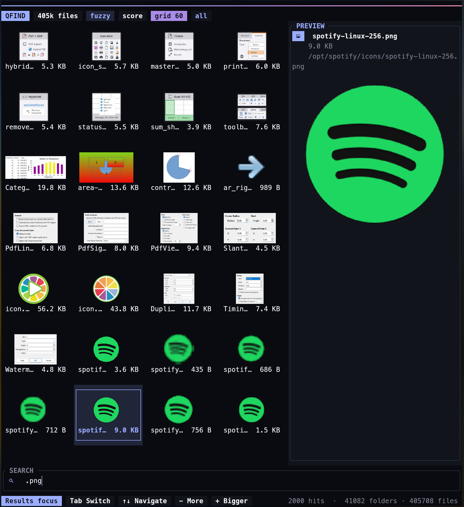
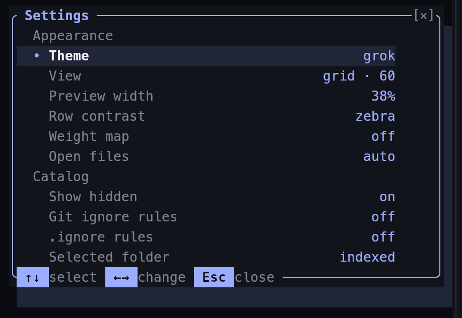

<div align="center">

# Qfind

instant filename search for Linux, with a keyboard-first TUI, GTK frontend, live previews, a folder browser, and an interactive WeightMap.

[](https://github.com/DerpcatMusic/qfind/releases/latest)
[](LICENSE)

[Features](#what-it-does) · [Install](#install) · [Controls](#tui-controls) · [Preview formats](#preview-support) · [Config](#config)

</div>

<p align="center">
  
</p>

Qfind builds one memory-mapped Catalog at `~/.cache/qfind/catalog` from your local Mounts. Queries search filenames without walking the filesystem again. Rebuild reads `getdents64` entries in parallel and avoids a `stat` call for every file; metadata is loaded only when a Sort or Preview needs it.

## What it does

- Fuzzy, substring, exact, glob, extension, FileClass, date, and folder searches
- List and grid surfaces with adjustable density
- Text, Markdown, image, SVG, PDF, video, audio, office, font, and extended-image Previews
- Dual-pane folder browser: folders on the left, contents on the right
- Interactive WeightMap by byte size or file count per extension
- Instant toggles for hidden files, `.gitignore`, global Git excludes, `.git/info/exclude`, and `.ignore`
- Configurable themes, zebra rows, Preview width, WeightMap visibility, editor, and open behavior
- Mouse selection, scrolling, resizable panes, context menus, and native file Drag in Kitty 0.47+
- GTK, Nautilus, Vicinae, and optional Qt/Breeze frontends

Qfind has no startup splash. Config changes made in the TUI are saved and applied immediately.

## Install

### Prebuilt x86_64 release

```bash
curl -L https://github.com/DerpcatMusic/qfind/releases/download/v0.2.0/qfind-0.2.0-x86_64.tar.zst \
  | tar -C /tmp -x --zstd
sudo install -Dm755 /tmp/qfind /tmp/qfind-tui -t /usr/local/bin
# Optional desktop frontend:
sudo install -Dm755 /tmp/qfind-gtk -t /usr/local/bin
sudo install -Dm644 /tmp/qfind.desktop /usr/local/share/applications/qfind.desktop
```

The archive also contains `qfind-gtk`, the desktop file, Nautilus integration, and `qfind-qt` when Qt6 was available on the release builder.

### Build from source

Requires Rust 1.88 or newer.

```bash
git clone https://github.com/DerpcatMusic/qfind.git
cd qfind
./packaging/install.sh
```

This installs `qfind` and `qfind-tui` in `~/.local/bin`. If GTK4 is available through `pkg-config`, it also installs `qfind-gtk`, the desktop launcher, and the Nautilus plugin. If Qt6 is available, it builds `qfind-qt` with Breeze styling.

For CLI and TUI only:

```bash
cargo build --release
```

Build the GTK frontend separately with `cargo build --release -p qfind-gtk`.

### Arch Linux

The repository includes source and binary PKGBUILDs:

```bash
cd packaging/aur/qfind && makepkg -si          # CLI/TUI from source
cd packaging/aur/qfind-bin && makepkg -si      # CLI/TUI prebuilt
cd packaging/aur/qfind-gtk && makepkg -si      # GTK from source
cd packaging/aur/qfind-gtk-bin && makepkg -si  # GTK prebuilt
```

## First run

```bash
qfind index    # rebuild the Catalog
qfind          # open the TUI
```

With arguments, `qfind` works as a regular CLI:

```bash
qfind kick wav                         # filenames containing both words
qfind .wav --files --sort largest      # extension search
qfind cat --folders                    # folders only
qfind logo --class image --json        # JSON lines for scripts
```

An empty Query in the TUI lists the Catalog. Fuzzy matching is the default; use `--match substring`, `--match exact`, or `Ctrl+M` in the TUI to change it. `*.wav` is a glob, while `.wav` filters by extension.

## TUI controls

| Input | Action |
|---|---|
| `Tab` | switch Search and Hits focus |
| arrows / wheel | move through Hits; the Preview follows |
| `Space`, `F3` | Preview the focused Hit |
| `Enter` / double-click | open a file or browse a folder |
| `F4` | dual-pane folder browser |
| `F6` | cycle WeightMap size / file types / off |
| `F8` | appearance, visibility, ignore rules, and folder Excludes |
| `F1` | shortcuts |
| `Ctrl+E` | cycle Auto / desktop / editor opening |
| `Ctrl+scroll`, `+`, `-` | change list or grid density |
| `Ctrl+O` | show the Hit in Files |
| `Ctrl+Y` | copy the path |
| right-click | Open, Preview, copy, and file-manager actions |
| mouse drag | hand a Hit to another desktop app in Kitty 0.47+ |

Drag uses Kitty's native OSC 72 protocol. Visual files reuse the current Preview as the cursor image; other files use a compact icon-and-name card. Dragging a Preview divider or scrollbar never starts a file Drag.

The Preview pane can be resized with its divider. Scrolling over it scrolls wrapped Preview content; scrolling over Hits moves the selection and updates the Preview. Grid density can be reduced until tiles become compact text cards or increased for larger visual thumbnails.

## Preview support

Raster images and text work without helper programs. Qfind uses installed desktop tools for other visual formats:

| Content | Helper |
|---|---|
| SVG | `rsvg-convert` |
| PDF, PostScript, comics, DjVu | `evince-thumbnailer` |
| video | `ffmpegthumbnailer` |
| audio waveform and extended images | `ffmpeg` |
| office documents | `gsf-office-thumbnailer` |
| fonts | ImageMagick `magick` |

Preview work runs away from input handling, stale jobs are discarded, and external helpers have a two-second deadline.

## Folder browser and WeightMap

Press `F4` to open the browser. Use `Tab`, `Left`, or `Right` to switch panes, `Enter` to descend, and `Backspace` to move to the parent folder. Entering a folder updates the WeightMap to that folder.

The WeightMap follows the current Query or browsed folder. Size mode uses file bytes; File Types mode counts files by extension. Click a folder tile to browse it or an extension tile to search it.

## Config

Press `F8` to edit appearance and Catalog visibility. Theme previews apply while moving through the list; confirmation is not required. Hidden-file and ignore-rule changes rerun the current Query immediately.

<p align="center">
  
</p>

Config is stored at `~/.config/qfind/config.toml` or `$XDG_CONFIG_HOME/qfind/config.toml`:

```toml
theme = "grok"             # grok | titanium | catppuccin | gruvbox | dracula | nord | aurora
preview_width = 36          # 20..70
zebra = true
weight_map = true
show_hidden = true
respect_gitignore = false
respect_ignore = false
open = "auto"              # auto | xdg | editor
editor = "nvim"            # empty = $EDITOR, then $VISUAL
```

Auto opening sends text files to the configured editor and folders or media to `xdg-open`. Selected folders can be added to or removed from exact Catalog Excludes from Search or the F4 browser.

## Desktop integrations

### GTK

Run `qfind-gtk` for the desktop frontend. Typing updates Hits immediately; Enter or double-click opens one, and rows can be dragged into other Wayland or X11 applications. The context menu provides Open, Open With, Preview, Show in Files, and Copy Path.

Space previews the hovered or selected Hit through GNOME Sushi when available, with a built-in window as fallback. Ctrl+scroll moves between compact lists, roomier rows, and a visual grid. The GTK settings include Excludes, Mounts, default Zoom, spacing, and reset. The virtual ListView/GridView does not `stat` during bind, keeps its scrollbars visible, and uses GSK composition.

### Nautilus and Vicinae

Install Nautilus and Vicinae support without rebuilding Qfind:

```bash
./packaging/install-plugins.sh
```

Nautilus adds **Ctrl+F** search for the current folder and **Search with Qfind** to the context menu. It needs `nautilus-python` on Arch or `python3-nautilus` on Debian-based systems. Vicinae adds a launcher command named **Qfind** and requires Node.js/npm for the TypeScript extension.

See [docs/plugins.md](docs/plugins.md) for manual installation and the script-only Vicinae fallback.

## Packages

- `qfind` / `qfind-bin`: CLI and TUI
- `qfind-gtk` / `qfind-gtk-bin`: GTK frontend and desktop integration
- `qfind-qt`: optional Qt6/Breeze frontend built by the installer and release script

## License

[MIT](LICENSE)
